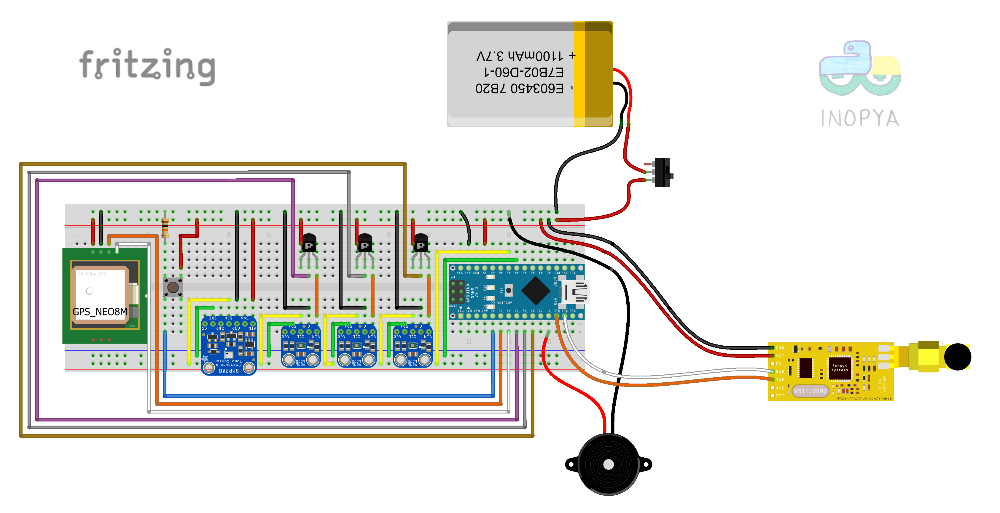

# CanSat_demo
Programa base para consurso Esero cansat >>  http://esero.es/cansat/

```diff
-REPOSITORIO EN PROCESO... 
```

Ultima actualizacion "CanSat_Delta"

===== NOTAS DE LA VERSION CanSat_Delta ===== 
  
  Programa para el Cansat del equipo SpaceSix.
      
  Simplificacion de CanSat_Gamma.
  Dispone de todos los elementos integrados, por tanto es apta para participacion en el concurso ESERO/SANSAT, 
  pero eliminadas todas las partes correspondientes a debug y testeo de sistemas durante la produccion, 
  convirtiendose  de esta manera en una version mas robusta y menos ávida de recursos.
  Renombradas algunas variables y añadidos algunos comentarios extra para facilitar el uso de este código.

  Se corresponde con la version v8 utilizada por los chavales del equipo SpaceSix 
  y es una optimizacion de dicha version. 
 
   usos de memoria para la v8 antes de optimizar:
   FLASH, 18802 bytes (58%).
   RAM utilizada, 1352 bytes (66%).

   usos de memoria para la v8 DESPUES DE OPTIMIZAR:
   FLASH, 18444 bytes (57%).
   RAM utilizada, 902 bytes (44%).


Este repositorio toma el relevo al "Datalogger_en_EEPROM_del_328p" desarrollado para cohetes de agua,
que se puede encontrar en https://github.com/inopya/Datalogger_en_EEPROM_del_328p


Mantiene el mismo concepto de grabación de datos en EEPROM. A priori en EEPROM interna del microcontrolador (está pensado para MCUs ATMega328p). Aun así, si por el volumen de datos recopilados o un tiempo de vuelo demasiado largo, se estimase necesario se podría facilmente cambiar el destino de grabación a una EEPROM externa. 

En este repositorio se encuentran utilidades para simplificar el manejo de dichas EEPROM externas (hasta 64K).

https://github.com/inopya/I2C_EEPROM
  
Otros repositorios relacionados y útiles para este proyecto son:

https://github.com/inopya/APC220_GUI_config   (configuración de APC220 desde entorno gráfico)

https://github.com/inopya/inopya_Universal_GPS  (librería de uso muy sencillo para control de GPS NEO6/7/8

https://github.com/inopya/Temporizador_Virtual  (librería para simplicifar el uso de tareas temporizadas)


  
Este es un programa base para datalogger y envío en tiempo real de dichos datos a una estación de tierra mientras el cohete está en vuelo.

Recopila datos de altitud y temperatura mediante un barómetro **BMP_280**, realiza mediciones de ultravioleta con tres sensores **VEML_6070**, y envía datos a una estación de tierra mediante un Transceptor **APC_220**.
Así mismo utiliza un **zumbador** y la emisión de la posición gps para ser localizado una vez en tierra con módulo **GPS_NEO_M8**.

Este montaje usa varios sensores ultravioleta en bus I2C con el inconveniente de que son identicos y por tanto con la misma dirección. Para poder controlarlos utilizamos un pequeño "truco":
alimentarlos de un pin digital e ir alternando cual está activo al momento de leer informacion desde el bus I2C:

**vease el esquema:**


****

```diff
+Toma de muestras y visualizacion de UVmax desde 2x VELM6070 sobre el mismo bus I2C
```


****

```diff
+Cansat Demo, montaje completo en protoboard
```



****
**Componentes**

    1x ARDUINO NANO
    3x VEML_6070
    1x BMP_280
    1x Zumbador
    1x GPS NEO 8M
    1x APC220
    3x 2N3906 (u otro transistor PNP similar)
    3x Resistencias 1-10 kΩ
    3x Diodo 1N5819 (o equivalente)
    1x Pulsador
    1x Resistencia 10 kΩ
    1x Bateria LiPo/Lion (reciclada de movil, tablet..)
    1x Interrutor
    Cables Dupont y protoboard
