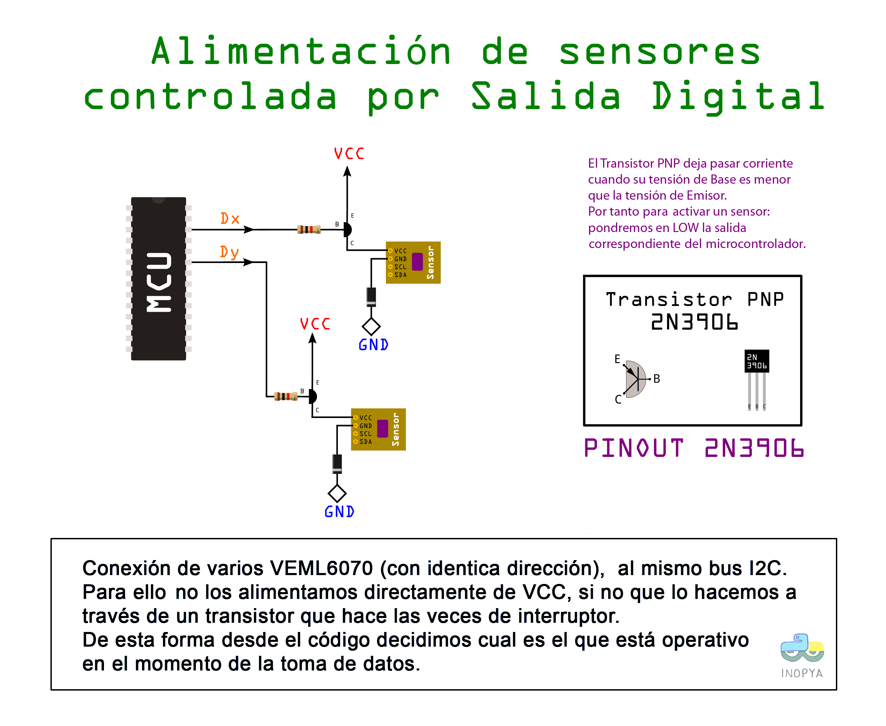

# CanSat_demo
Programa base para consurso Esero cansat >>  http://esero.es/cansat/

REPOSITORIO EN PROCESO......

  Este repositorio toma el relevo al Datalogger_en_EEPROM_del_328p
  
  que se puede encontrar en
  https://github.com/inopya/Datalogger_en_EEPROM_del_328p
  
  
Algunos repositorios relacionados y utiles para este proyecto son:

https://github.com/inopya/APC220_GUI_config

https://github.com/inopya/inopya_Universal_GPS

https://github.com/inopya/Temporizador_Virtual

  
Este es un programa base para datalogger y envio en tiempo real de dichos datos a una estacion de tierra mientras el cohete esta en vuelo.

Recopila datos de presion y temperatura mediante un barometro, relaiza mediciones de ultravioleta con tres sensores, y utiliza un zumbador y la emmision de la posicion GPS para ser localizado una vez en tierra.

Algunas partes aun estan en fase beta.

En este montaje usa varios sensores ultravioleta con el inconveniente de que son todos iguales y por tanto con la misma direccion, para ello utilizamos un pequeño "truco":
alimentarlos de un pin digital e ir alternando cual esta activo al momento de leer la informacion:

**vease el esquema:**

**Toma de muestras y visualizacion de UVmax desde 2x VELM6070 sobre el mismo bus I2C**

